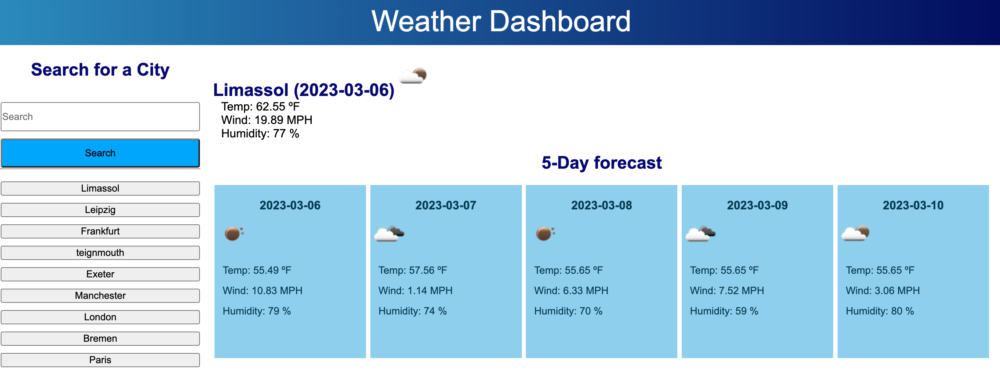

## Server-APIs-Weather-Dashboard
For a user to see the weather outlook for multiple cities to make plan accordingly

## Design
* When a user searches for a city they are presented with current and future conditions for that city and that city is added to the search history.
* When a user views the current weather conditions for that city they are presented with: the city name; the date; an icon representation of weather conditions; the temperature; the humidity; the wind speed; 
* When a user views future weather conditions for that city they are presented with a 5-day forecast that displays: the date; an icon representation of weather conditions; the temperature; the humidity
* When a user clicks on a city in the search history they are again presented with current and future conditions for that city.
  

## Links
Repo URL: https://github.com/annabessant/Server-APIs-Weather-Dashboard/tree/main 

Website URL: https://annabessant.github.io/Server-APIs-Weather-Dashboard/? 

Installation: git@github.com:annabessant/Server-APIs-Weather-Dashboard.git 

## Screenshot

## Contact
For further details and follow-up: anna@thefutureofinnovation.org 
